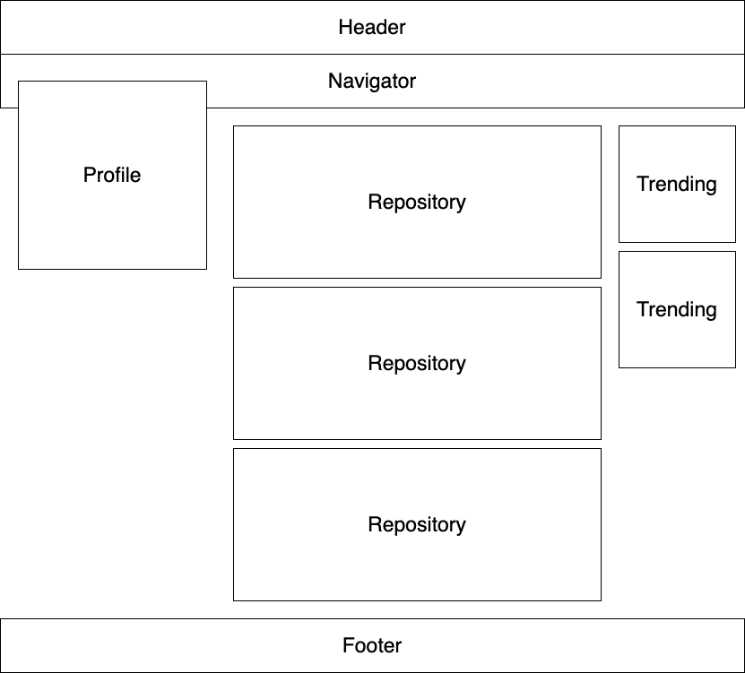

# 깃헙 사이트 클론 하기

다음 사이트(https://github.com/explore)[https://github.com/explore]에 접속해서  
해당 사이트의 UI가 나오도록 마크업을 해보겠습니다. 

영역은 크게 위와 같이 구성되어 있는 걸 확인해보실 수 있으며  
Footer를 제외하고 나머지 부분만 최대한 비슷하게 작업해주시면 됩니다.

## 조건

1. html과 css 파일은 분리해주세요.
2. 개발자 콘솔(소스 검사)을 보고 기존에 작성된 마크업을 따라하는 게 아니라 되도록 직접 작성해주셔야 합니다.
3. 구글링은 얼마든지 가능합니다.
4. 폴더 이름을 github_explore로 짓고 해당 폴더에서 작업해주세요.
5. 마지막으로, 작업해주신 코드를 origin에 push 해서 pull request를 날려주시면 됩니다.
